# Laboratorio 01: Creación de Cuenta AWS Free Tier

## 🎯 Objetivo

Crear una cuenta en AWS bajo el plan **Free Tier**, habilitando el acceso a los servicios gratuitos disponibles durante los primeros 12 meses.

---

## ℹ️ ¿Qué es el Free Tier?

AWS ofrece una **capa gratuita** que permite explorar muchos de sus servicios sin costo, siempre que se respeten ciertos límites mensuales.

👉 Consulta los detalles en el siguiente enlace:  
[🔗 Capa Gratuita de AWS (Free Tier)](https://tinyurl.com/aws-free-layer)

---

## 🛠️ Pasos para la creación de la cuenta

### 1. Acceder al portal de AWS
- Visita [https://aws.amazon.com/es/console](https://aws.amazon.com/es/console)  
- Haz clic en **"Crear una cuenta de AWS"**.

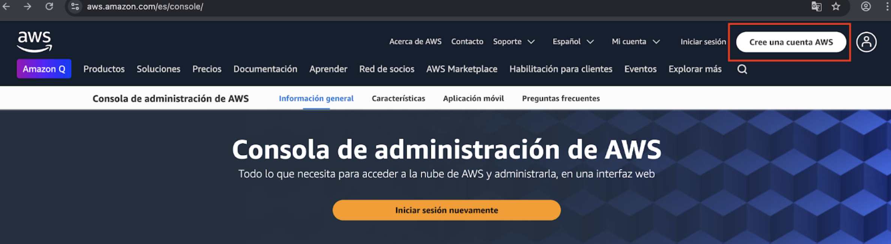

---

### 2. Registro del correo y nombre de cuenta
- Ingresa un correo electrónico que no esté asociado a una cuenta AWS.
- Escribe un nombre para tu cuenta, por ejemplo: `aws-leyva-labs`.
- Haz clic en **"Verificar la dirección de correo electrónico"**.

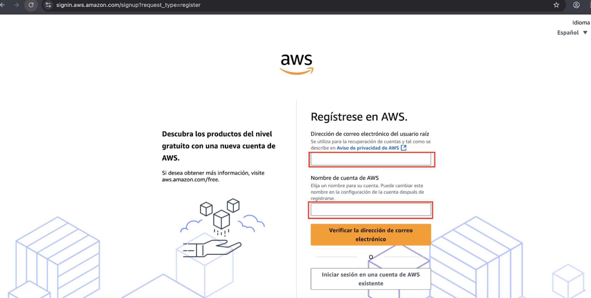

---

### 3. Verificación del correo electrónico
- Introduce el código de verificación que aparece en tu pantalla.
- Luego, presiona **"Enviar"**.

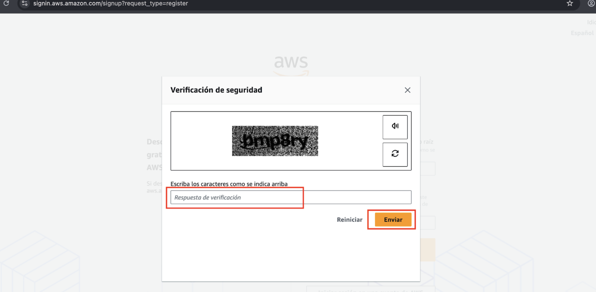

---

### 4. Confirmación del código enviado al correo
- AWS te enviará un email con un código.
- Ingresa ese código y presiona **"Verificar"**.

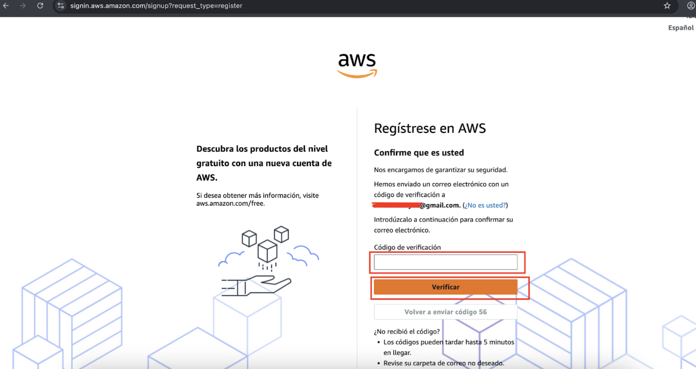

---

### 5. Configuración de la contraseña
- Ingresa y confirma una contraseña segura.
- Haz clic en **"Continuar (paso 1 de 5)"**.

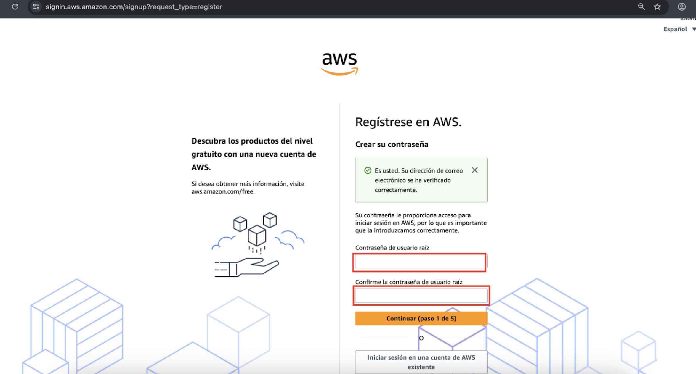

---

### 6. Información de contacto
- Completa tus datos personales o de empresa.
- Acepta los términos y haz clic en **"Aceptar y continuar (paso 2 de 5)"**.

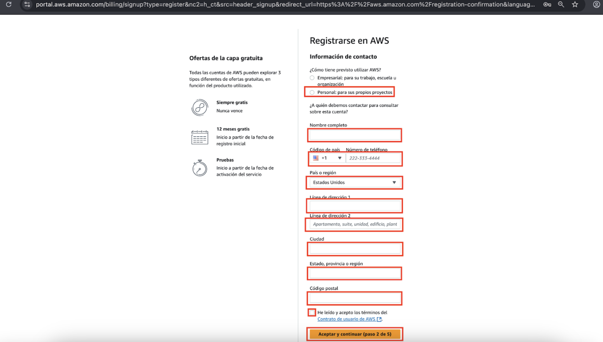

---

### 7. Información de pago
- Ingresa una tarjeta de crédito o débito válida.
- Completa la dirección de facturación.
- Haz clic en **"Verificar y continuar (paso 3 de 5)"**.

> ⚠️ *La tarjeta es solo para verificación. AWS no hará cargos si te mantienes dentro del Free Tier.*

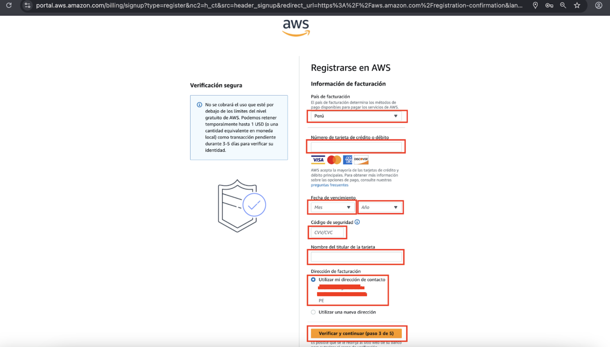

---

### 8. Verificación de identidad por teléfono
- Ingresa tu número de celular.
- Selecciona la opción de verificación por SMS.

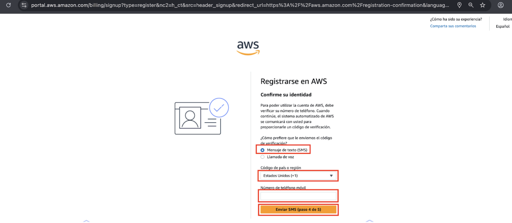

---

### 9. Validación de captcha

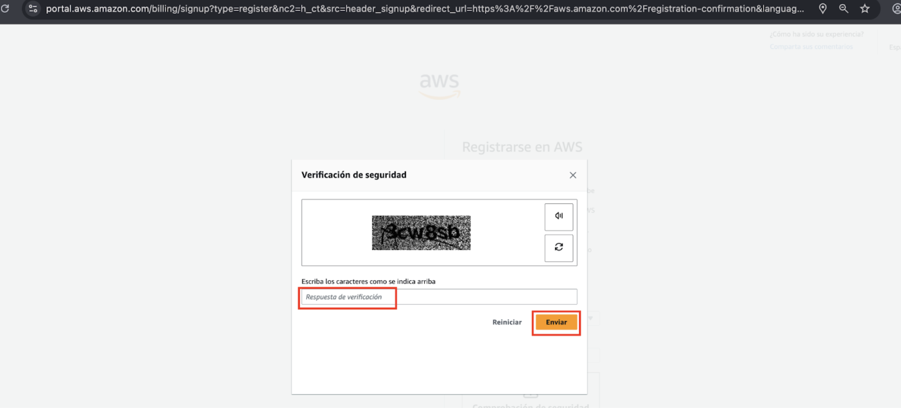

---

### 10. Código de verificación por SMS
- Ingresa el código que recibiste en tu teléfono.

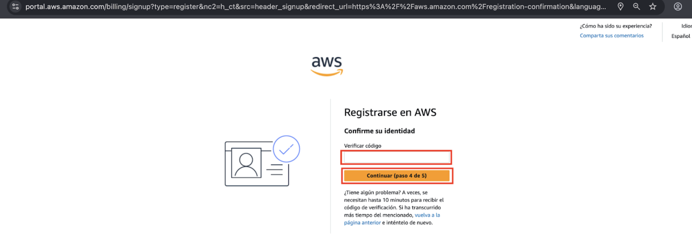

---

### 11. Selección del plan de soporte
- Elige la opción **"Soporte básico – Gratis"**.

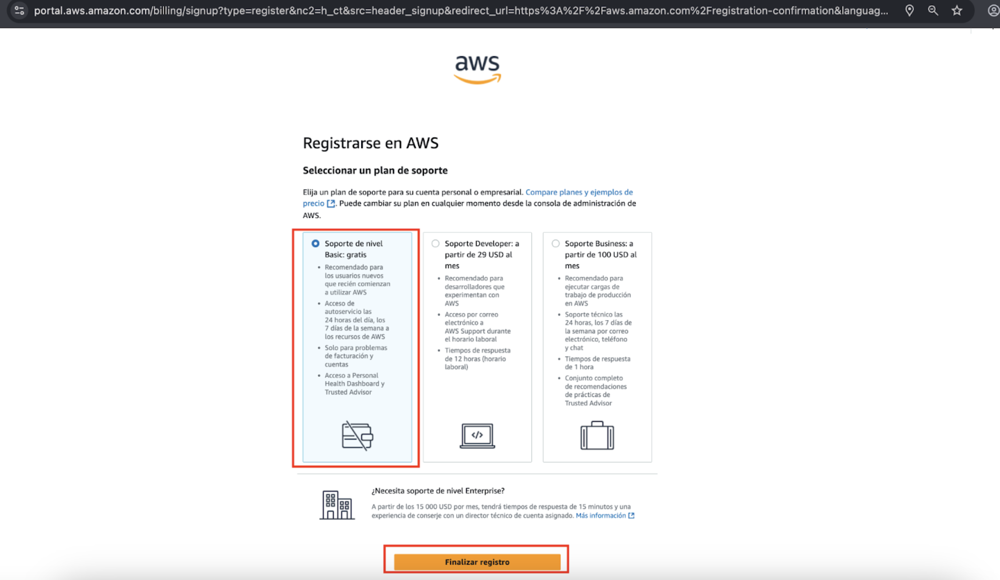

---

### 12. ¡Cuenta creada!
- Haz clic en **"Ir a la consola de administración de AWS"** para comenzar.

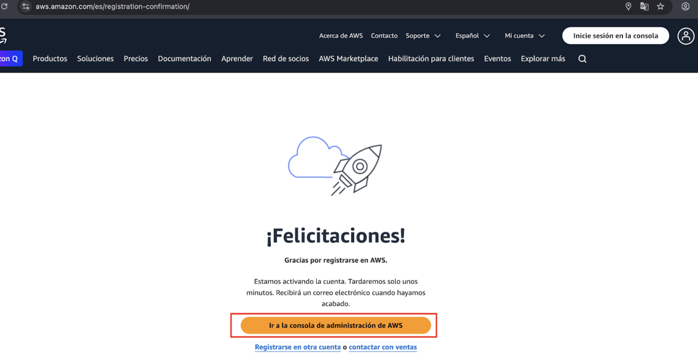

---

### 13. Primer ingreso a la consola
- Una vez autenticado, verás el **panel principal de la consola** de AWS.

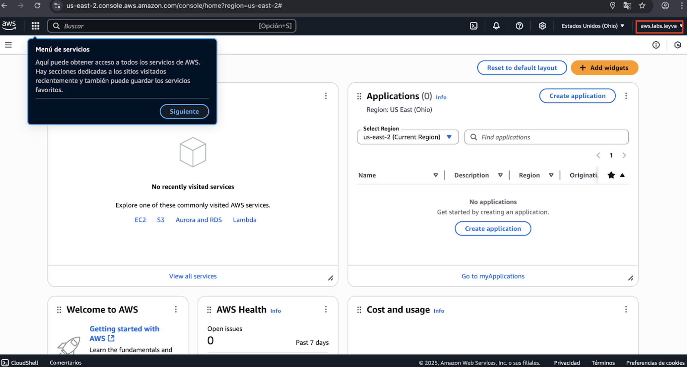

